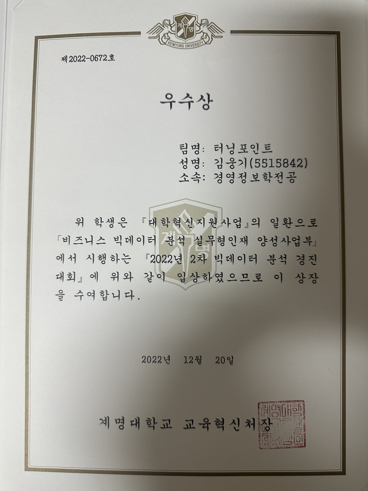

# 🧩 교내 데이터 분석 경진대회 (우수상)  
**기간:** 2022-11 ~ 2022-12

## 📌 맡은 역할
- EDA 및 데이터 전처리  
- 변수 선택 및 다중공선성 제거  
- 모델링 및 성능 비교  
- 보고서 작성  

## ⚙️ 프로젝트 개요  
- 122개 변수로 구성된 데이터셋을 분석해 예측 정확도 극대화  
- 결측치 및 불필요 변수 제거로 데이터 정제 수행  
- 문자형 이진 변수는 Label Encoding을 통해 숫자형으로 변환  

## ⚙️ 상세 활동  
- 변수 선택: Stepwise Selection 기법으로 유의미 변수 선별 및 불필요 변수 제거  
- 다중공선성 제거: VIF(Variance Inflation Factor) 기준으로 높은 공선성 변수 제거  
- PyCaret 활용:  
  - AutoML 기반 모델 비교로 상위 5개 모델 선정  
  - 하이퍼파라미터 튜닝 후 최종 LightGBM 모델 채택  
- 모델 해석:  
  - SHAP value 시각화를 통해 주요 영향 변수 도출  
  - 예측 결과에 기여한 변수 기반 인사이트 도출  

## 🏆 성과  
- 교내 데이터 분석 경진대회 우수상 수상  

## 💡 배운 점  
- PyCaret을 통한 다양한 모델 빠른 비교 및 최적 모델 선정 경험  
- SHAP 값을 활용한 모델 해석 가능성 확보  
- 다중공선성 문제 해결 과정을 실무에서 체감  
- 팀 협업을 통한 다양한 데이터 전처리 및 모델링 기법 적용  

  

